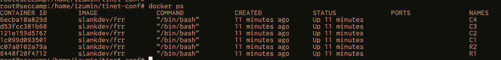

# 0x01-(3) TiNET入門 基本

### TiNETインストール
https://github.com/tinynetwork/tinet

```
wget https://github.com/tinynetwork/tinet/releases/download/latest/tinet_latest_linux64_amd64.tar.gz -O /tmp/tinet.tgz
tar xpf /tmp/tinet.tgz
sudo mv tinet /usr/bin
tinet --version
```

### 試す
1. 構成ファイルのYAML作成
    - slankdevさんの[これ](https://github.com/tinynetwork/tinet/blob/master/examples/simple/topo2/spec.yaml)を使う
2. 各ノードの作成
    > tinet up -c spec.yaml | sudo sh -x
    - Dockerで各ノードコンテナが立ち上がる(下図)
    
3. ノードに設定を読み込む
    > tinet conf -c spec.yaml | sudo sh -x
    - 各ノードに設定が投入される
    ```
    + docker exec R1 ip addr add 10.255.1.1/24 dev net0
    + docker exec R1 ip addr add 10.1.0.1/24 dev net1
    + docker exec R1 ip addr add 10.2.0.1/24 dev net2
    + docker exec R1 ip route add 10.3.0.0/24 via 10.255.1.2
    + docker exec R1 ip route add 10.4.0.0/24 via 10.255.1.2
    + docker exec R2 ip addr add 10.255.1.2/24 dev net0
    + docker exec R2 ip addr add 10.3.0.1/24 dev net1
    + docker exec R2 ip addr add 10.4.0.1/24 dev net2
    + docker exec R2 ip route add 10.1.0.0/24 via 10.255.1.1
    + docker exec R2 ip route add 10.2.0.0/24 via 10.255.1.1
    + docker exec C1 ip addr add 10.1.0.2/24 dev net0
    + docker exec C1 ip route add default via 10.1.0.1
    + docker exec C2 ip addr add 10.2.0.2/24 dev net0
    + docker exec C2 ip route add default via 10.2.0.1
    + docker exec C3 ip addr add 10.3.0.2/24 dev net0
    + docker exec C3 ip route add default via 10.3.0.1
    + docker exec C4 ip addr add 10.4.0.2/24 dev net0
    + docker exec C4 ip route add default via 10.4.0.1   
    ```
4. C1からC4にpingしてみる
    > docker container exec -it C1 ping 10.4.0.2
    ```
    PING 10.4.0.2 (10.4.0.2) 56(84) bytes of data.
    64 bytes from 10.4.0.2: icmp_seq=1 ttl=62 time=0.053 ms
    64 bytes from 10.4.0.2: icmp_seq=2 ttl=62 time=0.064 ms
    64 bytes from 10.4.0.2: icmp_seq=3 ttl=62 time=0.054 ms
    ^C
    --- 10.4.0.2 ping statistics ---
    3 packets transmitted, 3 received, 0% packet loss, time 2053ms
    rtt min/avg/max/mdev = 0.053/0.057/0.064/0.005 ms
    ```
    