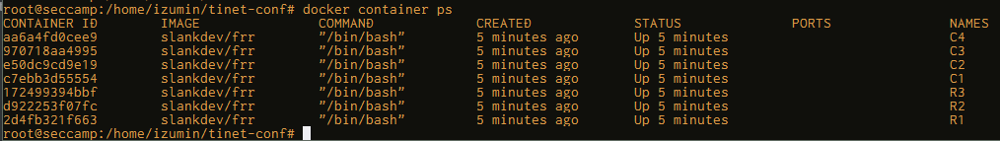

# 0x01-(3) TiNET入門 実践

### Virtual_Network_Playground_2をTiNETで試す
1. 構成ファイルのYAML作成
    - [vnet_playground2.yaml](vnet_playground2.yaml)
2. 各ノードの作成
    > tinet up -c vnet_playground2.yaml | sudo sh -x
    - 作成される
    
3. ノードに設定を読み込む
    > tinet conf -c spec.yaml | sudo sh -x
    - 各ノードに設定が投入される
    ```
    + docker exec R1 ip addr add 10.255.1.1/24 dev net0
    + docker exec R1 ip addr add 10.255.2.1/24 dev net3
    + docker exec R1 ip addr add 10.1.0.1/24 dev net1
    + docker exec R1 ip addr add 10.2.0.1/24 dev net2
    + docker exec R1 ip addr add 1.1.1.1/32 dev lo label lo:2
    + docker exec R1 ip route add 10.3.0.0/24 via 10.255.1.2
    + docker exec R1 ip route add 10.4.0.0/24 via 10.255.1.2
    + docker exec R1 ip route add 2.2.2.2/32 via 10.255.1.2
    + docker exec R1 ip route add 3.3.3.3/32 via 10.255.2.2
    + docker exec R1 ip route add 10.255.3.0/24 nexthop via 10.255.1.2 weight 1 nexthop via 10.255.2.2 weight 1
    + docker exec R2 ip addr add 10.255.1.2/24 dev net0
    + docker exec R2 ip addr add 10.255.3.1/24 dev net3
    + docker exec R2 ip addr add 10.3.0.1/24 dev net1
    + docker exec R2 ip addr add 10.4.0.1/24 dev net2
    + docker exec R2 ip addr add 2.2.2.2/32 dev lo label lo:2
    + docker exec R2 ip route add 10.1.0.0/24 via 10.255.1.1
    + docker exec R2 ip route add 10.2.0.0/24 via 10.255.1.1
    + docker exec R2 ip route add 1.1.1.1/32 via 10.255.1.1
    + docker exec R2 ip route add 3.3.3.3/32 via 10.255.3.2
    + docker exec R2 ip route add 10.255.2.0/24 nexthop via 10.255.1.1 weight 1 nexthop via 10.255.3.2 weight 1
    + docker exec R3 ip addr add 10.255.2.2/24 dev net0
    + docker exec R3 ip addr add 10.255.3.2/24 dev net1
    + docker exec R3 ip addr add 3.3.3.3/32 dev lo label lo:2
    + docker exec R3 ip route add 10.1.0.0/24 via 10.255.2.1
    + docker exec R3 ip route add 10.2.0.0/24 via 10.255.2.1
    + docker exec R3 ip route add 1.1.1.1/32 via 10.255.2.1
    + docker exec R3 ip route add 10.3.0.0/24 via 10.255.3.1
    + docker exec R3 ip route add 10.4.0.0/24 via 10.255.3.1
    + docker exec R3 ip route add 2.2.2.2/32 via 10.255.3.1
    + docker exec R3 ip route add 10.255.1.0/24 nexthop via 10.255.2.1 weight 1 nexthop via 10.255.3.1 weight 1
    + docker exec C1 ip addr add 10.1.0.2/24 dev net0
    + docker exec C1 ip route add default via 10.1.0.1
    + docker exec C2 ip addr add 10.2.0.2/24 dev net0
    + docker exec C2 ip route add default via 10.2.0.1
    + docker exec C3 ip addr add 10.3.0.2/24 dev net0
    + docker exec C3 ip route add default via 10.3.0.1
    + docker exec C4 ip addr add 10.4.0.2/24 dev net0
    + docker exec C4 ip route add default via 10.4.0.1
    ```
4. いろいろpingしてみる
    > docker container exec -it C1 ping 10.4.0.2
    ```
    PING 10.4.0.2 (10.4.0.2) 56(84) bytes of data.
    64 bytes from 10.4.0.2: icmp_seq=1 ttl=62 time=0.053 ms
    64 bytes from 10.4.0.2: icmp_seq=2 ttl=62 time=0.064 ms
    64 bytes from 10.4.0.2: icmp_seq=3 ttl=62 time=0.054 ms
    ^C
    --- 10.4.0.2 ping statistics ---
    3 packets transmitted, 3 received, 0% packet loss, time 2053ms
    rtt min/avg/max/mdev = 0.053/0.057/0.064/0.005 ms

    root@seccamp:/home/izumin/tinet-conf# docker container exec -it C1 ping 2.2.2.2
    PING 2.2.2.2 (2.2.2.2) 56(84) bytes of data.
    64 bytes from 2.2.2.2: icmp_seq=1 ttl=63 time=0.035 ms
    64 bytes from 2.2.2.2: icmp_seq=2 ttl=63 time=0.049 ms
    ^C
    --- 2.2.2.2 ping statistics ---
    2 packets transmitted, 2 received, 0% packet loss, time 1004ms
    rtt min/avg/max/mdev = 0.035/0.042/0.049/0.007 ms

    root@seccamp:/home/izumin/tinet-conf# docker container exec -it C1 ping 3.3.3.3
    PING 3.3.3.3 (3.3.3.3) 56(84) bytes of data.
    64 bytes from 3.3.3.3: icmp_seq=1 ttl=63 time=0.033 ms
    64 bytes from 3.3.3.3: icmp_seq=2 ttl=63 time=0.057 ms
    ^C
    --- 3.3.3.3 ping statistics ---
    2 packets transmitted, 2 received, 0% packet loss, time 1025ms
    rtt min/avg/max/mdev = 0.033/0.045/0.057/0.012 ms

    root@seccamp:/home/izumin/tinet-conf# docker container exec -it C4 ping 3.3.3.3
    PING 3.3.3.3 (3.3.3.3) 56(84) bytes of data.
    64 bytes from 3.3.3.3: icmp_seq=1 ttl=63 time=0.043 ms
    64 bytes from 3.3.3.3: icmp_seq=2 ttl=63 time=0.046 ms
    ^C
    --- 3.3.3.3 ping statistics ---
    2 packets transmitted, 2 received, 0% packet loss, time 1023ms
    rtt min/avg/max/mdev = 0.043/0.044/0.046/0.006 ms
    ```
