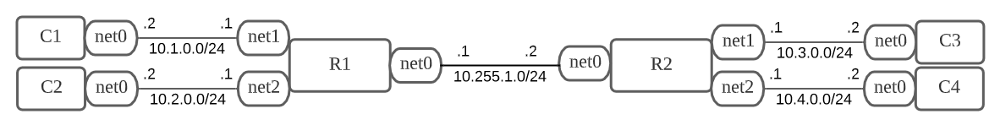

# BGP入門大会 topo2



1. FRR Setup
    - spec.yamlは指定のものを利用→[指定のページ](https://github.com/seccamp-z/2021Z4/tree/main/0x02)
    - 構成のとおりに起動
    > tinet up -c spec.yaml | sudo sh -x  
    > tinet conf -c spec.yaml | sudo sh -x
    - 起動後FRRが起動しているかvtyに入る
    ```
    # docker container exec -it R1 vtysh

    Hello, this is FRRouting (version 6.0).
    Copyright 1996-2005 Kunihiro Ishiguro, et al.
    ```
    - コマンドはCiscoライクなので?やTabを駆使する。
2. BGP Peer Setup
    - 今回のtopo2構成ではR[1,2]にRouting設定はされていない。
    - R[1,2]のConnectedに存在しない相手方のCXに到達するには経路を受け取る必要がある。
    - networkコマンドを利用して経路を広告させる。
    - R1はAS1, R2はAS2でPeering
    - Established状態に遷移すると下のように表示される※本来は経路はまだ来ないが設定後なのでPfxRcd 2になっている。
    ```
    R1# show ip bgp summary

    IPv4 Unicast Summary:
    BGP router identifier 10.255.1.1, local AS number 1 vrf-id 0
    BGP table version 12
    RIB entries 7, using 1120 bytes of memory
    Peers 1, using 21 KiB of memory

    Neighbor        V         AS MsgRcvd MsgSent   TblVer  InQ OutQ  Up/Down State/PfxRcd
    10.255.1.2      4          2      41      46        0    0    0 00:18:00            2

    Total number of neighbors 1
    ```
3. BGP Route Advertise
    - 経路を広告するには2種類。
        - networkコマンドで明示的に指定
        - redistributeコマンドで再配布
            - 明示的ではないのでFilterを設定しないと変な経路を流す可能性があるので注意
    - topo2の構成からR[1,2]に対してnetworkコマンドで設定を行う。
    - 全て設定が完了したrunning-config
    ```
    #### R1 ####
    R1# show run
    Building configuration...

    Current configuration:
    !
    frr version 6.0
    frr defaults traditional
    hostname R1
    log syslog informational
    no ipv6 forwarding
    service integrated-vtysh-config
    username cumulus nopassword
    !
    router bgp 1
    bgp router-id 10.255.1.1
    neighbor 10.255.1.2 remote-as 2
    !
    address-family ipv4 unicast
    network 10.1.0.0/24
    network 10.2.0.0/24
    exit-address-family
    !
    line vty
    !
    bfd
    !
    end

    #### R2 ####
    R2# show run
    Building configuration...

    Current configuration:
    !
    frr version 6.0
    frr defaults traditional
    hostname R2
    log syslog informational
    no ipv6 forwarding
    service integrated-vtysh-config
    username cumulus nopassword
    !
    router bgp 2
    bgp router-id 10.255.1.2
    neighbor 10.255.1.1 remote-as 1
    !
    address-family ipv4 unicast
    network 10.3.0.0/24
    network 10.4.0.0/24
    exit-address-family
    !
    line vty
    !
    bfd
    !
    end
    ```
4. Capture BGP Packet
    - R1上でtcpdumpを行う。
    - R2のnetworkコマンドをnoで未設定状態にする。
    - R2側のnet0をshutしておきtcpdumpを開始。
    - R1からR2のnet0にpingを送る
        - arp応答がないため失敗
    - R2 net0 をno shut
        - R2のnet0にpingが疎通
        - 同時にBGPがEstablished
    - R2にてnetworkコマンドで10.3.0.0/24, 10.4.0.0/24を設定
        - UPDATEメッセージが送られ、NLRIにプレフィックスが格納され送られる。
    - R1にてshow ip routeを行う。
    - C3, C4にpingが疎通する。
    ※BGPで経路交換する前のtcpdump時に10.3.0.0/24, 10.4.0.0/24にpingを送る場合、routing tableに存在しない+デフォルトルートがないためnet0から送信されないのでpcapに表示されない。
    ```
    R1# show ip route
    Codes: K - kernel route, C - connected, S - static, R - RIP,
        O - OSPF, I - IS-IS, B - BGP, E - EIGRP, N - NHRP,
        T - Table, v - VNC, V - VNC-Direct, A - Babel, D - SHARP,
        F - PBR,
        > - selected route, * - FIB route

    C>* 10.1.0.0/24 is directly connected, net1, 00:42:51
    C>* 10.2.0.0/24 is directly connected, net2, 00:42:51
    B>* 10.3.0.0/24 [20/0] via 10.255.1.2, net0, 00:27:06
    B>* 10.4.0.0/24 [20/0] via 10.255.1.2, net0, 00:26:43
    C>* 10.255.1.0/24 is directly connected, net0, 00:27:31
    ```

5. Analyze BGP Packets
    - OPENメッセージ
        - OPENメッセージが交換される前にTCPによる3Wayhandshakeが行われている。
        - OPENメッセージで交換される
            - Optional Parameter
            - Hold Time
            - BGP Identifier(Router-id)
            - ASN
            - Version
    - KEEPALIVEメッセージ
        - OPENメッセージの後にKEEPALIVEメッセージが交換されお互いにカウントダウンが始まる。
    - UPDATEメッセージ
        - その後UPDATEメッセージが交換される。
            - UPDATEメッセージにはNLRIに到達可能なプレフィックス格納されている。
            - PATH Attribute
                - ORIGIN: networkコマンドで広告された場合。再配布はIncomplate(?)となる
                - AS_PATH: リストだが送信元なので1つのみ
                - NEXT_HOP: eBGPなので自分自身の送信I/F
                - MULTI_EXXIT_DISC: 通称MED。設定していないので0
    - Wiresharkのfilter
        - `tcp.port ==179` と `bgp`の違い
            - TCPのネゴやAckなどが表示されるかされないか
        - `bgp.type ==2` BGPのUPDATE Messageのみが抽出される。